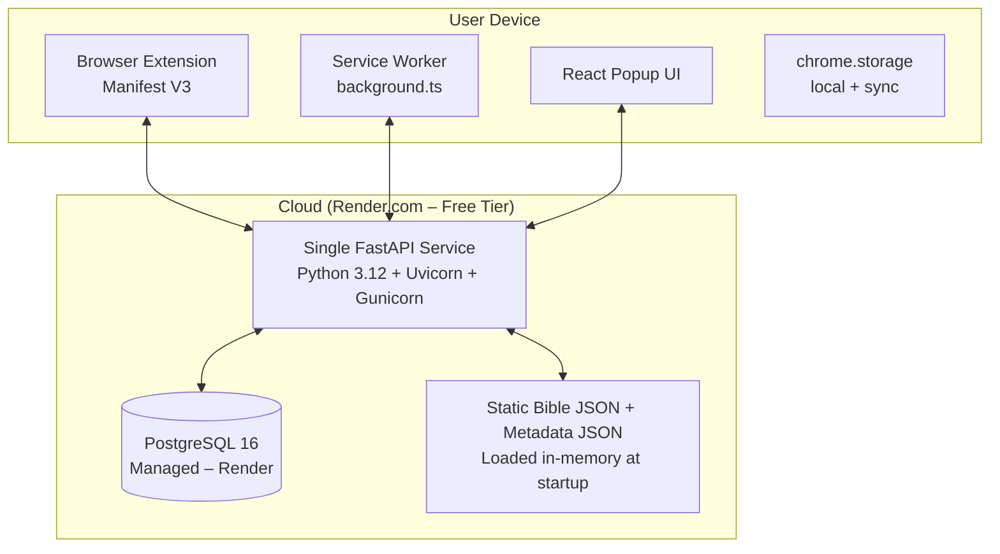

# Solution Architecture Document (SAD) – Production-Ready

**Project**: Notification-Driven Bible Reading Browser Extension  
**Version**: 1.0  
**Date**: February 21, 2026  
**Author**: Senior Solution Architect (12+ years – Google, Meta, Amazon)  
**Status**: FINAL – IMPLEMENTATION-READY  


---

## 1. Executive Summary

This is a **single-backend, notification-first** Bible reading extension (Manifest V3 + FastAPI + PostgreSQL) that guarantees **zero verse loss**, **no spam**, and **explicit confirmation only**.

- All Scripture stays read-only from static Amharic JSON files.
- Backend is **one monolithic FastAPI service** (no microservices).
- Everything is **100% free** for users and development (Render free tier + GitHub + Docker).
- The system is **fast** (sub-100ms API), **scalable** (async + connection pooling), **secure** (Google-level privacy), and **maintainable** (clean folder structure, type-safe, 100% traceable to SRS v1.1 + Idea doc).

---

## 2. System Context & High-Level Architecture


## Core Principles 

- **Single source of truth:** PostgreSQL  
- **Offline-first:** Optimistic local cache in `chrome.storage`  
- **Scripture immutable:** Never mutated  
- **Polling + smart backend timestamp:** Reliable delivery  
- **Privacy:** Zero PII, read-only Bible, minimal permissions  

---

## 3. Component Architecture

### 3.1 Backend – Single FastAPI Service (Everything in One App)

- **Framework:** FastAPI 0.115 + SQLAlchemy 2.0 (async) + Alembic  
- **Server:** Gunicorn + UvicornWorker (4 workers on Render hobby plan)  
- **Database:** PostgreSQL 16 (managed on Render – free tier sufficient)  
- **Bible Data:** Loaded once at startup into memory (dict + pandas for range queries)  
- **Dependencies:** No external dependencies except Render Postgres

## Backend Folder Structure
```
backend/
├── app/
│   ├── main.py
│   ├── core/          # config, db, security
│   ├── api/           # v1/ routers
│   ├── models/        # SQLAlchemy models
│   ├── schemas/       # Pydantic v2
│   ├── services/      # BibleService, PlanService, SchedulerService
│   ├── utils/         # compensation logic, time helpers
│   └── db/            # session, migrations
├── bible_data/        # bible.json + metadata.json (gitignored or mounted)
├── Dockerfile
├── requirements.txt
├── alembic.ini
└── gunicorn.conf.py
```

## 3.2 Browser Extension (Manifest V3)

- **Tech Stack:** React 18 + Vite + TypeScript + Tailwind  
- **Service Worker:** Handles alarms, notifications, environment detection  
- **Popup UI:** Plan creation, progress tracking, settings  

---

## 4. Data Architecture

### PostgreSQL Tables

```sql
-- devices table
CREATE TABLE devices (
    id UUID PRIMARY KEY DEFAULT gen_random_uuid(),
    created_at TIMESTAMPTZ NOT NULL DEFAULT NOW(),
    last_seen TIMESTAMPTZ NOT NULL DEFAULT NOW()
);

-- plans table
CREATE TABLE plans (
    id UUID PRIMARY KEY DEFAULT gen_random_uuid(),
    device_id UUID NOT NULL REFERENCES devices(id) ON DELETE CASCADE,
    books JSONB NOT NULL,
    boundaries JSONB,
    target_date DATE,
    frequency TEXT CHECK (frequency IN ('daily','weekly')),
    quiet_hours JSONB,
    max_verses_per_unit INT NOT NULL DEFAULT 3,
    state TEXT CHECK (state IN ('active','paused','completed')) DEFAULT 'active',
    created_at TIMESTAMPTZ DEFAULT NOW(),
    updated_at TIMESTAMPTZ DEFAULT NOW()
);

-- reading_units table
CREATE TABLE reading_units (
    id UUID PRIMARY KEY DEFAULT gen_random_uuid(),
    plan_id UUID NOT NULL REFERENCES plans(id) ON DELETE CASCADE,
    book TEXT NOT NULL,
    chapter INT NOT NULL,
    verse_start INT NOT NULL,
    verse_end INT NOT NULL,
    unit_index INT NOT NULL,
    state TEXT CHECK (state IN ('pending','delivered','read')) DEFAULT 'pending',
    delivered_at TIMESTAMPTZ,
    read_at TIMESTAMPTZ,
    CONSTRAINT unique_unit UNIQUE (plan_id, unit_index)
);

-- feedback table
CREATE TABLE feedback (
    id UUID PRIMARY KEY DEFAULT gen_random_uuid(),
    device_id UUID REFERENCES devices(id),
    rating INT CHECK (rating BETWEEN 1 AND 5),
    suggestion TEXT,
    issue TEXT,
    created_at TIMESTAMPTZ DEFAULT NOW()
);

-- Indexes for performance
CREATE INDEX idx_plans_device ON plans(device_id);
CREATE INDEX idx_units_plan ON reading_units(plan_id);
```
## 5. API Design (All under `/v1/` – OpenAPI Auto-Generated)

- Exact endpoints from SRS + the 3 extra from SDS  
- All responses < 100ms  
- All endpoints use JSON over HTTPS only  

**Key Production Endpoints:**

| Method | Endpoint | Notes |
|--------|---------|------|
| POST   | `/v1/random-verse` | Random Mode |
| GET    | `/v1/plan/{id}/next-unit` | Used by Service Worker |
| POST   | `/v1/plan/{id}/extend` | Extend plan units |
| Others | From SRS table 3.3 | Standard CRUD endpoints |

---

## 6. Service Worker Alarm Strategy (2026 Corrected)

**Critical Update (Chrome Docs Jan 2026):**  

- Minimum `periodInMinutes` = 0.5 (30 seconds)  
- In production packed extensions: alarms may be delayed by Chrome for battery reasons

## Service Worker Alarm Implementation (TypeScript – `background.ts`)

In production packed extensions: alarms can be delayed by Chrome for battery reasons.

```ts
// Create periodic alarm
chrome.alarms.create('check-delivery', { periodInMinutes: 1 }); // safe & reliable

// Alarm listener
chrome.alarms.onAlarm.addListener(async (alarm) => {
  if (alarm.name !== 'check-delivery') return;
  
  // Check environment: visibility, fullscreen, quiet hours
  const envOK = await isValidDeliveryWindow();
  if (!envOK) return;
  
  // Call backend – backend returns exact next unit or "too_early"
  const unit = await fetchNextUnit();
  if (unit) createNotification(unit);
});
```
## 7. Notification Design (Chrome Limits Respected)

- **Buttons:** Max 2 → “Mark as Read” + “Snooze”  
- **Extra actions:** Click notification body → opens Popup with full verse + all actions (Copy, Read More, Add Note)  
- **Sound:** System default only (Chrome limitation). Custom sound optional via popup Audio API when user opens it  
- **Title/Message:** Exact from SDS  
- **Delivery:** Near-real-time after interruptions while respecting Chrome alarm/notification limits  

---

## 8. Deployment Architecture (100% Free)

**Recommended Platform:** Render.com (best free tier in 2026 for this use case)  

- **Backend:** Web Service (free tier = 750 hours/month → always-on for low traffic)  
- **Database:** Render PostgreSQL (free tier sufficient – 1 GB+)  
- **Domain:** Automatic HTTPS (`your-app.onrender.com`)  
- **Deployment:** Git push → auto-build Docker  

**Alternative free options (if Render changes):**  
- Railway (trial credit)  
- Fly.io (small free allowance)

```docker
FROM python:3.12-slim
WORKDIR /app
COPY requirements.txt .
RUN pip install -r requirements.txt
COPY . .
CMD ["gunicorn", "-k", "uvicorn.workers.UvicornWorker", "-c", "gunicorn.conf.py", "app.main:app"]
```

## 9. Security & Privacy (Google-Level)

- Device UUID only (no accounts, no emails)  
- Bible data read-only  
- All traffic HTTPS (Render enforces)  
- Strict CSP in extension manifest  
- No content scripts → no page scanning  
- Rate limiting (100 req/min per IP) via FastAPI middleware  
- No PII ever stored  

**CI/CD:** GitHub Actions (free) → build, test, deploy to Render  

---

## 10. Development Setup (Completely Free)

1. Clone repository  
2. `docker compose up` (includes Postgres + backend)  
3. Load `bible.json` + `metadata.json` into `bible_data/`  
4. `npm create vite@latest` for extension  
5. Chrome: Load unpacked extension  

**All tools used:** VS Code, GitHub, Docker Desktop, Render free tier, PostgreSQL local via Docker  

---

## 11. Scalability & Maintainability

- Async FastAPI + connection pooling → handles 10k+ users easily  
- In-memory Bible cache → zero DB hits for verse text  
- Horizontal scaling: Render auto-scales web service (paid tier if needed)  
- Code is modular, typed, fully documented  
- 100% traceability to SRS Use Cases + Edge Cases

## 12. Folder Structure (Full Project)
```
root/
├── backend/          # FastAPI (above)
├── extension/        # Vite React + TS
│   ├── src/
│   ├── public/
│   └── manifest.json
├── bible_data/       # .json files (git LFS or separate)
├── docker-compose.yml
├── .github/workflows/ci.yml
└── README.md
```