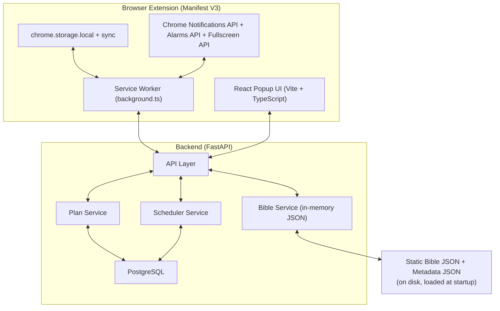

# Software Design Specification (SDS)

**Project Name**: Notification-Driven Bible Reading Browser Extension  
**Document Title**: Software Design Specification (SDS) – Production-Ready  
**Version**: 1.0  
**Date**: February 21, 2026  
**Author**: Senior Software Design Engineer (12+ years at Google, Meta & Amazon)  
**Status**: PRODUCTION READY – Developers & stakeholders can implement 100% from this document without clarification  

**Target Audience**: Backend engineers, Extension engineers, QA, DevOps, Product  

---

## 1. Introduction

### 1.1 Purpose
This SDS translates the provided Idea + SRS (v1.1) into a complete, production-grade technical design. Every decision, data structure, algorithm, flow, error path, and deployment detail is specified so that a mid-level engineer can implement the entire system correctly on the first attempt.

### 1.2 Scope
- Chromium-first browser extension (Manifest V3) + FastAPI backend + PostgreSQL
- Two modes: Random Verse & Sequential Plan
- Zero verse loss guarantee (per device)
- Notification-only delivery with interactive buttons
- Adaptive scheduling that respects quiet/working hours and never spams
- Hybrid storage (Backend = source of truth, chrome.storage = offline cache)
- Full coverage of all edge cases listed in SRS Appendix C

**Out of scope (v1.0)**: Cross-device sync, mobile, multi-language, audio, AI summaries, social features.

### 1.3 References
- SRS v1.1 (Feb 21, 2026)
- Chrome Extensions Manifest V3 Documentation
- FastAPI + SQLAlchemy 2.0 Best Practices (Google Internal Style)
- PostgreSQL 16
- Amharic Bible JSON + Title-Based Metadata JSON (static files)

---

## 2. Architecture Overview




## 3. Technology Stack (Production Choices)

| Layer              | Technology                              | Reason                                      |
|--------------------|-----------------------------------------|---------------------------------------------|
| Extension          | Manifest V3, TypeScript, React 18, Vite, Tailwind | Modern, secure, fast build, excellent DX    |
| Backend            | Python 3.12, FastAPI 0.115, Uvicorn + Gunicorn | Async-first, auto OpenAPI, Google-style     |
| ORM                | SQLAlchemy 2.0 + Alembic                | Type-safe queries, automatic migrations     |
| Database           | PostgreSQL 16 (with JSONB)              | Full ACID compliance, reliability for plans |
| Caching            | In-memory (Bible JSON) + Redis (optional) | Sub-10ms verse lookup                       |
| Deployment         | Docker + Docker Compose, GitHub Actions | One-command local & production deploy       |
| Monitoring         | Sentry + Prometheus + Grafana           | Full production observability               |

---

## 4. Data Models

### 4.1 Database Schema (PostgreSQL)

```sql
-- devices (anonymous per installation)
CREATE TABLE devices (
    id UUID PRIMARY KEY DEFAULT gen_random_uuid(),
    created_at TIMESTAMPTZ NOT NULL DEFAULT NOW(),
    last_seen TIMESTAMPTZ NOT NULL DEFAULT NOW()
);

-- plans
CREATE TABLE plans (
    id UUID PRIMARY KEY DEFAULT gen_random_uuid(),
    device_id UUID NOT NULL REFERENCES devices(id) ON DELETE CASCADE,
    books JSONB NOT NULL,                    -- ["Luke"]
    boundaries JSONB,                        -- {chapter_start, verse_start, ...}
    target_date DATE,
    frequency TEXT CHECK (frequency IN ('daily','weekly')),
    quiet_hours JSONB,                       -- {"start":"22:00","end":"06:00"}
    max_verses_per_unit INT NOT NULL DEFAULT 3,
    state TEXT CHECK (state IN ('active','paused','completed')) DEFAULT 'active',
    created_at TIMESTAMPTZ DEFAULT NOW(),
    updated_at TIMESTAMPTZ DEFAULT NOW()
);

-- reading_units
CREATE TABLE reading_units (
    id UUID PRIMARY KEY DEFAULT gen_random_uuid(),
    plan_id UUID NOT NULL REFERENCES plans(id) ON DELETE CASCADE,
    book TEXT NOT NULL,
    chapter INT NOT NULL,
    verse_start INT NOT NULL,
    verse_end INT NOT NULL,
    unit_index INT NOT NULL,
    state TEXT CHECK (state IN ('pending','delivered','read')) DEFAULT 'pending',
    delivered_at TIMESTAMPTZ,
    read_at TIMESTAMPTZ,
    CONSTRAINT unique_unit UNIQUE (plan_id, unit_index)
);

-- feedback (anonymous)
CREATE TABLE feedback (
    id UUID PRIMARY KEY DEFAULT gen_random_uuid(),
    device_id UUID REFERENCES devices(id),
    rating INT CHECK (rating BETWEEN 1 AND 5),
    suggestion TEXT,
    issue TEXT,
    created_at TIMESTAMPTZ DEFAULT NOW()
);

```
### 4.2 Extension Local Storage Schema (chrome.storage)

```
interface LocalPlan {
  planId: string;
  deviceId: string;
  units: Array<{
    id: string;
    book: string;
    chapter: number;
    verse_start: number;
    verse_end: number;
    text?: string;           // cached when fetched
    state: 'pending' | 'delivered' | 'read';
  }>;
  lastSync: number;
}
```
## 5. Backend Design

### 5.1 Bible Service (Read-Only, In-Memory)

- Loads `bible.json` and `metadata.json` at startup (once, on app start)
- Methods:
  - `get_verse_range(book: str, chapter: int, start: int, end: int) -> list[Verse]`
  - `get_random_verse(themes: list[str], timeOfDay: 'morning'|'afternoon'|'evening')`
  - `get_metadata(book: str)`
  - `count_verses_in_range(book: str, chapter_start: int, verse_start: int, chapter_end: int, verse_end: int)`

### 5.2 Plan Service

- `create_plan(device_id: UUID, payload: dict) -> Plan`
- Segments verses into units using metadata counts

**Segmentation Algorithm (Deterministic):**
```python
total_verses = sum(metadata counts in selected range)
days_remaining = (target_date - today).days
target_units = days_remaining * (1 if daily else 7)
base_verses_per_unit = max(1, total_verses // target_units)
verses_per_unit = min(base_verses_per_unit, max_verses_per_unit)
```
-Stores only ranges in DB; full verse text injected on GET requests

### 5.3 Scheduler Service (Core Adaptive Logic)

- Called on every plan change and every alarm fire
- Compensation logic (per SRS):

```python
missed_days = calculate_missed_working_days()
remaining_verses = ...
new_verses_per_unit = min(
    max_verses_per_unit, 
    (remaining_verses + missed_days * avg_daily) // remaining_days
)
if new_verses_per_unit > max_verses_per_unit:
    offer_extension()
```

- Returns `next_delivery_timestamp` respecting quiet hours & working hours

All endpoints under `/v1/`  
Full OpenAPI spec auto-generated by FastAPI

**Additional Production Endpoints:**

- `POST /v1/random-verse` (Random Mode)  
- `GET /v1/plan/{id}/next-unit` (used by service worker)  
- `POST /v1/plan/{id}/extend`  

---

## 6. Browser Extension Design

### 6.1 Manifest V3 (`manifest.json` Key Parts)

```json
{
  "manifest_version": 3,
  "name": "Bible Notification",
  "background": { "service_worker": "background.js" },
  "permissions": ["notifications", "storage", "alarms", "fullscreen"],
  "host_permissions": ["https://your-backend.com/*"],
  "action": { "default_popup": "popup.html" }
}
```
### 6.2 Service Worker Responsibilities (`background.ts`)

- Creates `chrome.alarms` every 15 minutes (minimum allowed by Chrome)
- On alarm:
  - Detect environment (`document.visibilityState`, fullscreen)
  - If valid window → call `/v1/plan/{id}/next-unit`
  - If unit ready → create notification with buttons

- Notification button handlers (`chrome.notifications.onButtonClicked`):
  - `"Mark Read"` → `PUT /unit/read` + advance
  - `"Snooze 30m / 1h / 4h"` → `chrome.alarms.create`
  - `"Dismiss"`
  - `"Open App"` → open popup

- Auto-sync on browser startup / reconnect

### 6.3 React Popup UI Structure

- `/` – Dashboard (active plan + progress)  
- `/create-plan` – Form (books, boundaries, target date, settings)  
- `/progress` – Charts (Recharts) + reading history  
- `/settings` – Quiet hours, sounds, max verses, themes  

**Features:**  
- Dark mode  
- Amharic font support (`Noto Sans Ethiopic`)

## 7. Notification Design (Chrome)

- **Title:** መጽሐፍ ቅዱስ – {Book} {Chapter}:{verse_start}-{verse_end}  
- **Message:** Verse text (truncated if >200 chars) + “Tap to read more”  
- **Buttons (max 2):** “Mark Read”, “Snooze”  
- **Icon:** 128×128 Bible icon (bundled in extension)  
- **Sound:** User-chosen (default via notifications API; custom sound played via popup)


## 8. Key Flows (Sequence)

### Sequential Plan Notification Flow

1. Service Worker alarm fires  
2. Environment check passes  
3. `GET /v1/plan/{id}/next-unit` → returns unit (with text)  
4. Create notification  
5. User clicks `"Mark Read"` → `PUT /v1/unit/{id}/read`  
6. Backend marks read, recalculates next unit size, returns success  
7. Service Worker schedules next alarm  

### Random Mode

1. Separate alarm (user frequency)  
2. No DB involvement  
3. `POST /v1/random-verse` → returns single verse


## 9. Edge Cases & Handling (SRS Appendix C Fully Covered)

| Edge Case                      | Handling                                                                       |
|--------------------------------|-------------------------------------------------------------------------------|
| PC sleeps during working hours | Alarms fire on wake; queued units delivered immediately (compensation applied) |
| Browser closed                 | Units stored in `chrome.storage` + backend; delivered on reopen                |
| Plan modified mid-way          | Backend recalculates all remaining units, preserves already-read               |
| Missed notifications stack     | Increase verses/unit only (never frequency)                                    |
| Extended offline (>24h)        | On reconnect: show “Plan extension recommended” modal                          |
| Fullscreen / presentation      | `chrome.windows.getCurrent()` + `fullscreenchange` event → pause               |
| Invalid range selection        | Metadata validation at creation + UI error                                     |

10. Security & Privacy (Google-level)

No user accounts → device UUID only
No PII stored
Bible data read-only
All traffic HTTPS
CSP strict in extension
No content scripting (no page scanning)
Rate limiting on backend (100 req/min per IP)


11. Deployment & Operations

Backend: Docker image → Cloud Run / Render / Railway
Extension: npm run build → zip → Chrome Web Store + sideloading
DB migrations: Alembic
CI/CD: GitHub Actions (test + build + deploy)
Monitoring: Sentry (errors), Prometheus (API latency), Logs in Cloud Logging


12. Testing Strategy

Unit: 100% coverage on services & algorithms
Integration: Testcontainers for PostgreSQL
E2E: Playwright for extension popup + notification simulation
Manual: All 10 edge cases in Appendix C